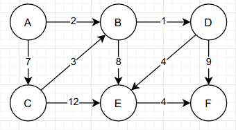

Dijkstra's Algorithm (Ruby)
Implement Dijkstra's algorithm to find the shortest path between two nodes. If you need a reminder of how the algorithm works, have a look at this explanation of Dijkstra's algorithm.

If you are having trouble making a start try creating a flow chart and use pseudo code.

The graph will be given as an specifying the weighted, directed edges of the graph:

{'A'=> { 'B'=> 2, 'C'=> 7 }, 'B'=> { 'D'=> 1, 'E'=> 8 }, 'C'=> { 'B'=> 3, 'E'=> 12 }, 'D'=> { 'E'=> 4, 'F'=> 9 }, 'E'=> { 'F'=> 4 }, 'F'=> {} }

This is the graph represented by this object:

Implement the function dijkstra, which takes in the object, a starting node, and ending node as input, and returns an object with the distance and path (as an array of nodes) for the shortest path.

Example:

problem = {'A'=> { 'B'=> 2, 'C'=> 7 }, 'B'=> { 'D'=> 1, 'E'=> 8 }, 'C'=> { 'B'=> 3, 'E'=> 12 }, 'D'=> { 'E'=> 4, 'F'=> 9 }, 'E'=> { 'F'=> 4 }, 'F'=> {} }

dijkstra(problem, 'A', 'F')  # should return {distance: 11, path: ['A', 'B', 'D', 'E', 'F']}